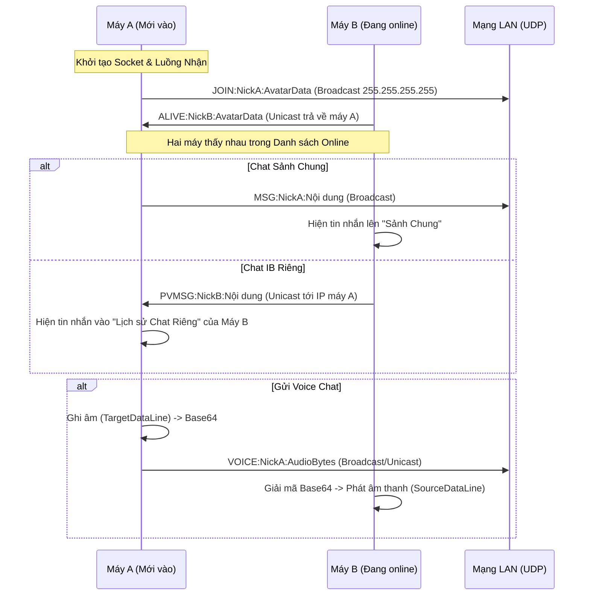
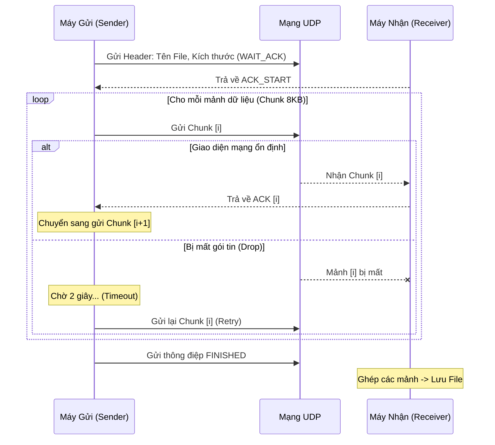
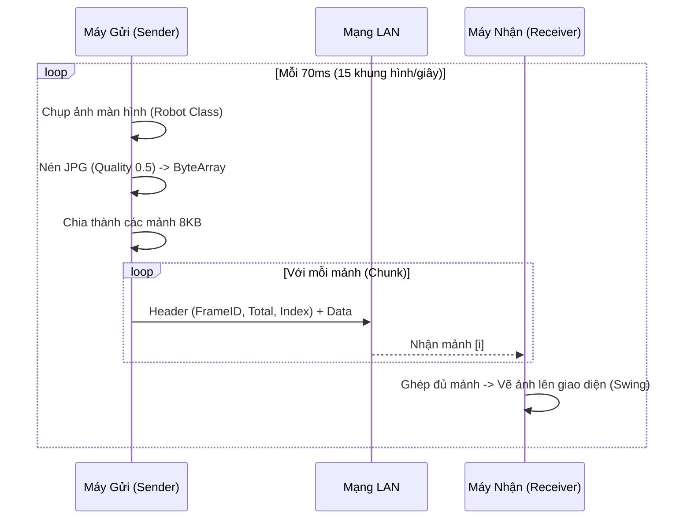

# 📝 KỊCH BẢN BÁO CÁO: UDP SOCKET LABORATORY

## 📘 DEMO 1: BẢNG TRẮNG ĐỒNG BỘ (WHITEBOARD SYNC)

### 1. Kiến thức cơ sở lý thuyết
*   **Giao diện đồ họa (GUI):** Sử dụng `JPanel` và `Graphics2D` của Java AWT/Swing để vẽ trực tiếp lên màn hình.
*   **Sự kiện chuột (Mouse Events):** Lắng nghe các sự kiện `mousePressed` (bắt đầu vẽ) và `mouseDragged` (di chuyển chuột để tạo nét vẽ).
*   **Truyền tin UDP Broadcast:** Sử dụng địa chỉ `255.255.255.255` để gửi tọa độ nét vẽ tới tất cả máy tính trong cùng mạng LAN mà không cần thiết lập kết nối trước.

### 2. Mô hình tổng quát (Architecture)
*   **Mô hình:** Peer-to-Peer (P2P). Mỗi máy tham gia vừa là người gửi (Sender) vừa là người nhận (Receiver).
*   **Cấu trúc gói tin:** Một chuỗi văn bản (String) đơn giản được chuyển thành mảng byte để tối ưu tốc độ.
    *   Định dạng: `DRAW:x1:y1:x2:y2:color_rgb`
    *   Ví dụ: `DRAW:100:150:110:160:-16777216` (Vẽ một đoạn thẳng từ (100,150) đến (110,160) màu đen).

### 3. Quy trình xử lý (Workflow)
1.  **Người dùng vẽ:** Khi người dùng kéo chuột trên máy A, app ghi lại tọa độ điểm cũ (prevX, prevY) và điểm mới (currX, currY).
2.  **Gửi dữ liệu:** App ngay lập tức nén tọa độ này vào một gói `DatagramPacket` và bắn ra mạng LAN qua UDP.
3.  **Nhận dữ liệu:** Luồng `ReceiverThread` trên máy B liên tục lắng nghe. Khi nhận được gói có tiền tố `DRAW:`, nó sẽ tách chuỗi để lấy tọa độ.
4.  **Vẽ lại:** Máy B sử dụng `Graphics2D` vẽ đoạn thẳng tương ứng lên `BufferedImage` của mình và gọi `repaint()` để cập nhật giao diện.

### 4. Ý nghĩa các hàm & Dòng code Socket quan trọng

#### A. Khởi tạo mạng (Network Setup)
```java
socket = new DatagramSocket(null); // Tạo Socket
socket.setReuseAddress(true);      // Cho phép nhiều app dùng chung cổng (demo trên 1 máy)
socket.bind(new InetSocketAddress(7777)); // Gắn cổng 7777 cho Bảng Trắng
socket.setBroadcast(true);         // Kích hoạt chế độ gửi tin cho toàn mạng LAN
```

#### B. Gửi tọa độ (Broadcasting Coordinates)
*   **Hàm:** `sendDrawAction(int x1, int y1, int x2, int y2)`
*   **Logic:** Chuyển tọa độ thành String -> byte[] -> Gửi đi. UDP được chọn vì ta cần gửi hàng chục gói tin mỗi giây (High Frequency), TCP sẽ gây ra hiện tượng nét vẽ bị "giật" (Lag) vì phải chờ ACK.

#### C. Nhận và xử lý (Processing Incoming Data)
```java
// Tách chuỗi nhận được từ gói tin
String[] p = message.split(":");
if (p[0].equals("DRAW")) {
    int x1 = Integer.parseInt(p[1]);
    int y1 = Integer.parseInt(p[2]);
    // ... lấy các tọa độ khác
    drawOnCanvas(x1, y1, x2, y2, color); // Vẽ lên "canvas" của máy mình
}
```

### 5. Giải thích chi tiết phục vụ thuyết trình
*   **Tại sao lại vẽ bằng đoạn thẳng (Line)?** "Dạ thưa thầy/cô, thực tế nét vẽ tự do là tập hợp của hàng ngàn đoạn thẳng cực ngắn nối lại với nhau. Việc gửi tọa độ đầu-cuối của đoạn thẳng giúp nét vẽ mịn màng hơn là chỉ gửi từng điểm chấm đơn lẻ."
*   **Ưu điểm UDP trong demo này:** "Trong vẽ tranh thời gian thực, tốc độ là ưu tiên số 1. Nếu một gói tin tọa độ bị mất giữa chừng (Packet Loss), nét vẽ chỉ bị một vết đứt rất nhỏ mà mắt thường khó thấy, nhưng đổi lại chúng ta có sự đồng bộ tức thì, không có độ trễ (Delay) như khi dùng TCP."
*   **Tính năng bổ sung:** "Em còn tích hợp lệnh `CLEAR` để khi một máy nhấn nút 'Xóa bảng', toàn bộ các máy khác cũng sẽ tự động xóa sạch màn hình của mình qua lệnh Broadcast."

---

## 💬 DEMO 2: PHÒNG CHAT ĐA PHƯƠNG THỨC (ZALO STYLE)

### 1. Kiến thức cơ sở lý thuyết
*   **Chế độ kết hợp (Hybrid Mode):** Sử dụng **Broadcasting** để tìm kiếm bạn bè (Discovery) và chat nhóm; sử dụng **Unicasting** để nhắn tin riêng (1-1) nhằm bảo mật và tối ưu hiệu suất.
*   **Xử lý đa luồng (Multithreading):** Chạy luồng nhận tin nhắn riêng biệt để không gây "đóng băng" giao diện Swing khi đang truyền tải dữ liệu lớn như Voice.
*   **Audio Sampling:** Dữ liệu âm thanh thô (Raw Byte) được nén và mã hóa dưới dạng Chuỗi **Base64** để dễ dàng vận chuyển qua các gói tin văn bản UDP.

### 2. Mô hình tổng quát (Sequence Diagram chuẩn)

Đây là quy trình "Bắt tay" và "Nhắn tin" thực tế trong ứng dụng:



### 3. Ý nghĩa các hàm quan trọng

#### A. Hàm `initNetwork()` (Cấu hình "tai" nghe của ứng dụng)
```java
socket = new DatagramSocket(null); 
socket.setReuseAddress(true); // QUAN TRỌNG: Cho phép 2 app cùng chạy trên 1 máy tính để Demo
socket.bind(new InetSocketAddress(8888)); // Gắn chết cổng 8888
```

#### B. Hàm `processIncoming()` (Trung tâm điều phối - Router)
Hàm này đóng vai trò như một "nhà mạng" mini, phân tích tiền tố gói tin để đưa tin nhắn vào đúng vị trí:
*   Nếu `JOIN`: Thêm bạn vào danh sách, gửi chào mừng.
*   Nếu `MSG`: Đưa vào `chatHistories.get("")` (Sảnh chung).
*   Nếu `PVMSG`: Dựa vào IP người gửi để ném tin nhắn vào đúng ô Chat riêng của người đó.
*   Nếu `QUIT`: Xóa người đó khỏi danh sách để giải phóng bộ nhớ.

#### C. Hàm `startRecording()` & `playVoice()` (Xử lý âm thanh)
*   **Ghi âm:** Dùng `TargetDataLine` để thu âm từ Microphone, chuyển thành mảng byte.
*   **Phát âm:** Dùng `SourceDataLine` và thiết lập `AudioFormat(8000Hz, 8bit)` (Chuẩn điện thoại bàn ngày xưa) để nghe lại được ngay qua UDP mà không bị trễ.

### 4. Giải thích code chi tiết cho phần thuyết trình
*   **Tại sao tin nhắn PVMSG lại "nhảy" đúng vào ô chat riêng?** 
    "Dạ, trong code em có sử dụng một Map `chatHistories` với Key là địa chỉ IP. Khi nhận được một gói `PVMSG` từ IP `192.168.1.5`, hệ thống sẽ tự động tìm model chat tương ứng với IP đó để hiển thị. Nếu chúng ta đang ở Sảnh chung, hệ thống sẽ hiện thêm một dấu **🔴 [New]** để nhắc người dùng có tin nhắn mới."
*   **Vấn đề Avatar có làm nặng gói tin UDP không?** 
    "Em đã tối ưu bằng cách Resize Avatar xuống chỉ còn **64px**. Khi nén lại, nó chiếm chưa tới 1KB, hoàn toàn nằm trong giới hạn 'An toàn' của một gói tin UDP (MTU ~1500 bytes), giúp việc đồng bộ danh sách cực kỳ nhanh."
*   **Chiến thuật "Double Broadcast" cho gói JOIN:** 
    "Thưa thầy/cô, vì UDP không đảm bảo 100% đến đích, nên khi mới vào phòng, em cho máy gửi gói `JOIN` **2 lần liên tiếp** để đảm bảo chắc chắn các máy khác nhận được thông tin định danh của em."

---

## 📂 DEMO 3: TRUYỀN FILE TIN CẬY (RELIABLE UDP)

### 1. Kiến thức cơ sở lý thuyết
*   **Giao thức Stop-and-Wait ARQ:** Là cơ chế gửi một gói tin và dừng lại chờ xác nhận (ACK) từ phía nhận trước khi gửi gói tiếp theo.
*   **Cơ chế Timeout:** Nếu quá thời gian quy định không nhận được ACK, máy gửi giả định gói tin đã mất và tự động gửi lại (Retransmission).
*   **Checksum/Integrity:** Đảm bảo dữ liệu nhận được không bị sai lệch so với nguồn.

### 2. Mô hình tổng quát (Sequence Diagram)

Quy trình truyền tải từng mảnh dữ liệu để đảm bảo không mất file:



### 3. Ý nghĩa các hàm quan trọng

#### A. Hàm `sendFile()` (Chiến thần điều phối)
Hàm này thực hiện vòng lặp `while` để đọc file từ đĩa, chia thành mảng byte 8KB và gọi lệnh gửi. Điểm quan trọng nhất là nó được đặt trong khối `try-catch` bắt lỗi `SocketTimeoutException`.

#### B. Hàm `socket.setSoTimeout(2000)`
Đây là dòng code "linh hồn" của Demo này. Nó ngăn không cho Socket đợi mãi mãi. Nếu bên nhận không gửi ACK trong 2 giây, hàm `socket.receive()` sẽ ném ra lỗi để ta biết đường mà gửi lại.

#### C. Hàm `receiveFile()` (Phía bên kia chiến tuyến)
Máy nhận đơn giản là ngồi đợi dữ liệu. Mỗi khi nhận xong 1 mảnh, nó phải gửi ngay 1 gói tin nhỏ chứa chữ "ACK" về địa chỉ IP của máy gửi để "báo tin vui".

### 4. Giải thích code chi tiết cho phần thuyết trình
*   **Tại sao lại chia mức 8KB mà không gửi cả file?** 
    "Dạ, giới hạn lý thuyết của UDP là 64KB nhưng thực tế qua các Router/Switch, gói tin lớn rất dễ bị phân mảnh và mất mát. Mức **8KB** là con số tối ưu em đã thử nghiệm để đạt tốc độ tốt mà ít bị lỗi nhất."
*   **Nếu ACK bị mất thì sao?** 
    "Trong trường hợp mảnh dữ liệu đến nơi nhưng ACK bị mất trên đường về, máy gửi vẫn sẽ Timeout và gửi lại mảnh đó. Máy nhận của em đã có logic kiểm tra: nếu mảnh đó nhận rồi thì chỉ việc gửi lại ACK mà không ghi đè vào file, đảm bảo file cuối cùng không bị dư thừa dữ liệu."
*   **Cách tính tiến độ (Progress Bar):** 
    "Em lấy `tổng số byte đã gửi` chia cho `tổng dung lượng file` để cập nhật lấn át giao diện theo thời gian thực, giúp người dùng theo dõi quá trình truyền tải."

---

## 🖥️ DEMO 4: CHIA SẺ MÀN HÌNH (SCREEN MIRRORING)

### 1. Kiến thức cơ sở lý thuyết
*   **Packet Fragmentation (Phân mảnh gói tin):** Một hình ảnh chụp màn hình sau khi nén vẫn có dung lượng từ 100KB - 200KB. Vì gói tin UDP bị giới hạn bởi MTU (thường là 64KB), ta phải chia nhỏ ảnh thành các mảnh (Chunks) dưới 10KB để tránh mất gói hàng loạt.
*   **JPEG Compression:** Sử dụng thư viện nén ảnh JPG để giảm dung lượng file xuống mức tối đa nhưng vẫn giữ được độ nét để đọc được chữ.
*   **Frame Reassembly (Tái cấu trúc khung hình):** Kỹ thuật ghép các mảnh vụn nhận được từ mạng để tạo lại hình ảnh nguyên bản dựa vào ID.

### 2. Mô hình tổng quát (Sequence Diagram)

Quy trình Livestream màn hình máy tính:



### 3. Ý nghĩa các hàm quan trọng

#### A. Header 12-byte (Cấu trúc gói tin chuyên nghiệp)
```java
ByteBuffer bb = ByteBuffer.allocate(12 + length);
bb.putInt(frameID);     // ID của khung hình (Khung 1, Khung 2,...)
bb.putInt(totalChunks); // Tổng số mảnh của khung hình đó
bb.putInt(chunkIdx);    // Thứ tự của mảnh hiện tại
```
Đây là kỹ thuật thực tế dùng trong Giao thức truyền tải thời gian thực (RTP). Nhờ có Header này, dù các mảnh đến sai thứ tự (Out-of-order), máy nhận vẫn biết mảnh nào nằm đâu để ghép lại đúng.

#### B. Hàm `compressJPG()`
Sử dụng `ImageWriter` để tinh chỉnh độ nén. Nếu mạng mạnh, ta có thể tăng Quality lên 0.9 để hình ảnh cực nét, nếu mạng yếu ta giảm xuống 0.3 để hình ảnh mượt mà, không bị lag.

#### C. Lớp `FrameBuffer` (Máy Nhận)
Máy nhận sử dụng một `HashMap` để lưu trữ các mảnh đang được ghép. Nếu một mảnh bị mất giữa chừng quá lâu (Timeout), hệ thống sẽ tự động xóa bộ nhớ đệm (cleanup) để chuẩn bị cho khung hình mới nhất.

### 4. Giải thích code chi tiết cho phần thuyết trình
*   **Tại sao không gửi ảnh PNG?** 
    "PNG là nén không mất dữ liệu, ảnh rất nặng. Với livestream, JPG là lựa chọn số 1 vì nó cho phép nén dữ liệu cực mạnh mà vẫn duy trì tốc độ truyền tải cao."
*   **Làm sao để đạt được tốc độ 15-20 FPS?** 
    "Em dùng luồng (Thread) riêng biệt để chụp và nén ảnh. Đồng thời, em tăng kích thước nhận của Socket (`setReceiveBufferSize`) lên 2MB để máy có thể 'nuốt' một lượng lớn gói tin dồn dập đổ về."
*   **Xử lý thế nào khi mạng bị nhiễu?** 
    "Dạ, kiến trúc của em hỗ trợ bỏ qua khung hình lỗi. Nếu một khung hình bị thiếu mảnh do rớt gói, máy nhận chỉ cần hủy bỏ khung đó và chờ khung hình tiếp theo ngay sau đó 70ms. Nhờ vậy, người xem vẫn thấy màn hình trôi chảy mà không bị đứng hay treo ứng dụng."

---

## 🏆 KẾT LUẬN CHUNG
Dự án UDP Laboratory đã chứng minh được tính hiệu quả của giao thức UDP trong các bài toán thực tế cần tốc độ và đồng bộ cao. Bằng việc kết hợp khéo léo giữa các kỹ thuật lập trình như Multi-threading, Audio Sampling và Packet Chunking, chúng ta đã xây dựng được một hệ thống demo mạnh mẽ, tiệm cận với các ứng dụng thương mại.

